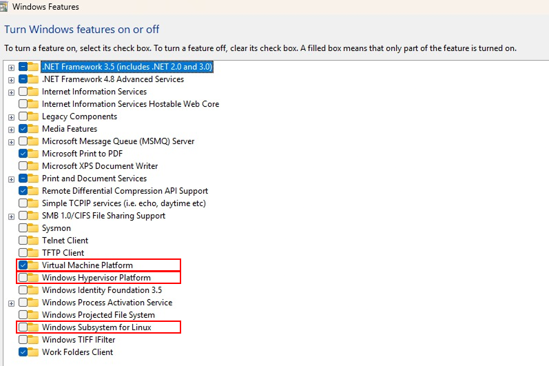

# Windows Subsystem for Linux Installation

1. Before installing WSL, open `Windows Features` then enable `Windows Subsystem for Linux`, `Virtual Machine Platform` and `Windows Hypervision Platform`.



2. After enabling in `Windows Features`, open terminal. You can use `PowerShell` or `CMD`.
3. Once you get into terminal, install WSL. For this subject, we are gonna use Ubuntu 24 for running Seismic Unix. You can check the available distributions using the following command:
```bash
wsl --list --online
```
4. Once you have checked the available distributions, you can install Ubuntu 24 using the following command:
```bash
wsl --install -d Ubuntu-24.04
```
5. After installation, check the installation by running the following command:
```bash
wsl --version
```
The output should be like this:
```bash
NAME            STATE           VERSION
* Ubuntu-24.04    Running         2
```
