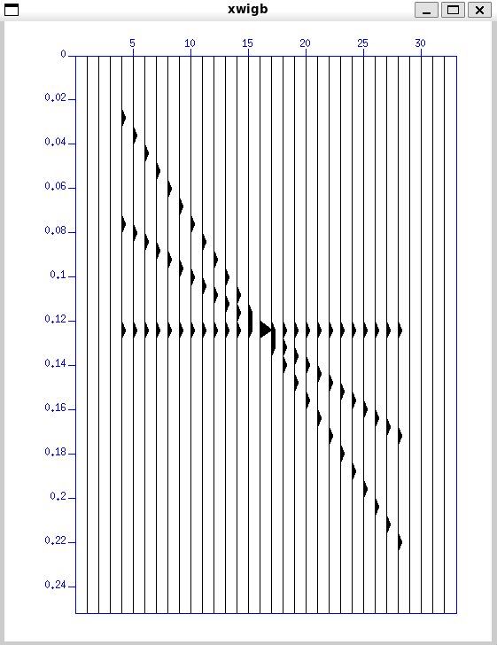

# Seismic Unix Installation
## Preparation
- Make sure you are in Linux home directory
```bash
cd ~
```

There are two ways to download Seismic Unix:

### A. Download from GitHub
You can `clone` Seismic Unix from the source code
```bash
git clone https://github.com/JohnWStockwellJr/SeisUnix.git
```

After cloning are completed, go to the Seismic Unix folder and then follow the installation steps in the next section.
```bash
cd SeisUnix
```


### B. Download from CWP website
Download Seismic Unix from this [website](https://wiki.seismic-unix.org/start). Make sure you download the latest version (44R28). After downloading, I would recommend to place the file in Linux directory instead of Windows (in the Downloads folder by default). Move the zipped file from Windows directory to the Linux directory:
```bash
mkdir SeisUnix && mv /mnt/c/Users/<username>/Downloads/cwp_su_all_44R28.tgz SeisUnix/
```
Change the `<username>` to your actual username. 
> Note: You may need to learn basic Linux commands to navigate and move files. Check out [this](./1_intro_to_linux.pdf) tutorial for basic Linux commands.

After moving the file, extract it:
```bash
cd SeisUnix && tar -xzf cwp_su_all_44R28.tgz
```

Another package that may be useful is `gedit`. You can install it using:
```bash
sudo apt-get update && sudo apt-get upgrade -y
sudo apt-get install gedit
```

## Installation Steps
1. Install the required dependencies:
```bash
sudo apt install build-essential
sudo apt install gfortran
sudo apt install libx11-dev
sudo apt install libxt-dev
sudo apt install freeglut3-dev
sudo apt install libxmu-dev libxi-dev
sudo apt install libc6
sudo apt install libuil4
sudo apt install libmotif-dev
sudo apt install libtirpc-dev
```
Type `y` for each prompt.

2. After installing the dependencies, we configure the environment variables. Add the following commands to your profile, by default, Ubuntu uses `~/.bashrc`.
```bash
export CWPROOT=$HOME/SeisUnix
export PATH=$PATH:$CWPROOT/bin:.
```

3. After setting the environment variables, edit the config file:
```bash
cd ~/SeisUnix/src
```
Since we use Ubuntu 24, copy the `Makefile.config_Linux_Ubuntu_22.04` from config folder:
```bash
cp ./configs/Makefile.config_Linux_Ubuntu_22.04 ./Makefile.config
```
This step will replace Makefile.config with the Ubuntu 22 config file (but works perfectly with Ubuntu 24).

4. Install the Seismic Unix, make sure that we still in `src` folder:
```bash
make install && make xtinstall && make finstall
```
Make sure the installation is successful by checking there is no error message.

5. Check the installation by running a test program:
```bash
suplane | suxwigb
```
The output should be like this



After installation is completed, you can run the program from any directory. So that you can place the data files anywhere you want.


> If there are any errors, copy and send the error message to my [email](mailto:vandanu2004@gmail.com)
