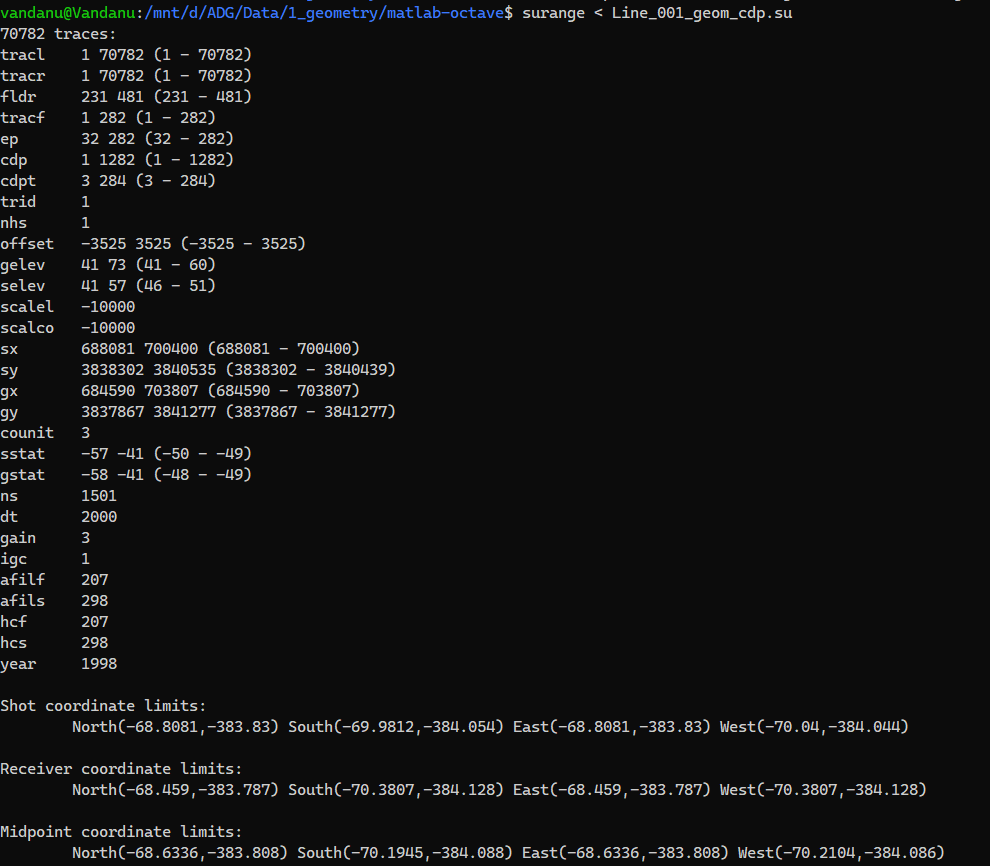

# Apply Geometry for 2D Land Seismic Data using Python

These notes cover how to apply geometry on 2D land seismic data. I already did a version in MATLAB/Octave, but here I’m also showing how to do it in Python. You can run the workflow either in Jupyter Notebook or Spyder, depending on what’s comfy.

## (Optional) Setup for Python Environment

If you’re on Windows with Anaconda/Miniconda, you probably already have Spyder or Jupyter Notebook installed. But if not, here’s the quick setup:

- Install Jupyter Notebook

```bash
sudo apt install jupyter-notebook jupyter-core python3-ipykernel
```

Run it with:

```bash
jupyter notebook
```

- Install Spyder

```bash
sudo apt update
sudo apt install spyder
```

Launch it with:

```bash
spyder
```

## Step 1 – Collecting data from SPS, RPS, and XPS files

```python
import os, math, csv, numpy as np
from matplotlib import pyplot as plt
```

Sets the working tools: filesystem (`os`), math ops, CSV output, NumPy for arrays, Matplotlib for plots. `os.chdir(...)` switches into your data folder so relative filenames work.

Tip: put `with open(...)` when reading files (safer) and avoid hardcoding paths if sharing code.

### Read SPS (sources)

```python
fhand = open(fname1)
sp=[]; sx=[]; sy=[]; selev=[]; sstat=[]
for line in fhand:
    if not line.startswith('H26'):
        sp.append(line[17:25]); sx.append(line[46:55]); ...
```

- What it does: reads fixed-width columns from SPS (skip header lines starting H26) and extracts:
1. `sp` = source ID
2. `sx`, `sy` = source easting/northing
3. `selev` = source elevation
4. `sstat` = source static
- Then strips spaces and converts types (`int` for IDs, `float` for coords/elev/statics).
- Builds dictionaries for quick lookup: `sx_params[sp_id] = sx_value`, etc.

Later you need to look up a source's X/Y/elev/stat by its ID. Slicing fixed widths is sensitive, so make sure the column indices exactly match your SPS format.

### Read RPS (receivers)

Same as SPS but for receiver file:
- produces lists `rp_int`, `rx_int`, `ry_int`, `relev_int`, `rstat_int`
- builds dicts `rx_params`, `ry_params`, `relev_params`, `rstat_params`.

### Read XPS (shot and receiver relation)

```python
xp = []; r1=[]; r2=[]
for line in fhand:
    if not line.startswith('H26'):
        xp.append(line[29:37]); r1.append(line[63:71]); r2.append(line[71:79])
# convert to ints
x_params = {'xp': xp_int, 'r1': r1_int, 'r2': r2_int}
x_params2 = { int(xp_int[i]) : list(range(int(r1_int[i]), int(r2_int[i]) + 1)) for i in ... }
```

- What: `x_params['xp'][i]` = shot ID (VP), and `r1`/`r2` are the first & last receiver IDs active for that shot.
- `x_params2` expands that into a mapping: `shot_id → [receiver_id_1, receiver_id_2, …]`.

Why: this tells you exactly which receiver channels are paired with each shot and necessary to iterate shot→receiver pairs.

### Build per-trace geometry & compute offsets

Main loop:
```python
offset=[]; sxcoor=[]; sycoor=[]; ...; tracl=[]; temp=0
for i in range(0, np.shape(xp_int)[0]):         # loop shots
    for j in range(0, 282):                     # 282 channels per shot
        if (x_params['xp'][i] in sp_int and x_params['r1'][i] in rp_int ...):
            sxcoor_temp = sx_params[x_params['xp'][i]]
            rxcoor_temp = rx_params[x_params2[x_params['xp'][i]][j]]
            offset_temp = sqrt((rx-sx)^2 + (ry-sy)^2)
            if shot_id > receiver_id:
                offset_temp = -offset_temp   # sign convention
            append lots of lists...
            tracl_temp = temp + j + 3
    temp = tracl_temp
```

-  Loop logic: iterate every shot (i) and every channel (j) for that shot; pick source and j-th receiver for that shot; compute geometry, offset, and append to lists.
- Offset calculation: Euclidean distance between receiver and source. Then a sign rule: `if shot_id > receiver_id`: make negative → this produces signed offsets (left side = negative, right side = positive). Useful for plotting shot gathers with left/right separation in **split-spread**.
- `x_params2[...] [j]` explained: `x_params['xp'][i]` gives the shot ID (e.g., 701). `x_params2[701]` is the list of receiver IDs for that shot; `[j]` selects the *j*-th receiver ID.
- `tracl` logic: `tracl_temp = temp + j + 3` then `temp = tracl_temp`, this is a counter for trace numbers but the +3 is arbitrary and can cause off-by shifts. Better is `tracl.append(len(tracl) + 1)`.

For the validation, check lengths after this block: `len(sxcoor) == number_of_shots * channels_per_shot` (should be 251 * 282 if all channels exist).

### Create CDP list (per trace)

```python
cdp_each_shot = []
for i in range(1, 252):
    start = 4 * i - 3
    end = 281 + (4 * i - 3)
    cdp_each_shot.extend(range(start, end + 1))
```

- What it does: for each shot `i` it generates a consecutive block of CDP numbers from `start` to `end` (inclusive). Each shot contributes 282 CDPs (end - start + 1 = 282).
- Generalized form: `start = s * i - (s - 1)` and `end = start + (Nrec - 1)` where `s` is the CDP shift per shot and `Nrec` is number receivers (282 here).
- Why 4? 4 is the per-shot CDP shift used by the code (i.e., each shot’s start CDP = previous start + 4). This number comes from the acquisition design (ratio shot-interval / receiver-interval and/or professor convention). If shot spacing and receiver spacing differ, 4 may change. -3 simply makes the first start = 1.
Example: `start = 4*1 - 3 = 1` → shot1: `1..282`, shot2: `5..286`, etc.

CDP list length must match geometry lists. If you see negative CDPs or weird counts, inspect this block and the expected shift s.

### Offset regularization (snap to bins)

```python
right = np.arange(25, 3526, 25)     # 25, 50, ..., 3525
left  = np.arange(-3525, -24, 25)   # -3525, -3500, ..., -25
offset_each_shot = np.concatenate((left, right))
offset_each_shot = np.tile(offset_each_shot, 251).flatten().tolist()
```
- Purpose: create a regularized offset axis (±25 m bins up to ±3525 m) and repeat it for every shot.
- Why: field offsets are messy; many processing steps (NMO, stacking) prefer consistent discrete offset bins. Regularization snaps traces into those bins (or simply assigns those bins as the offsets you feed SU).
- `+1` in `3525+1` was to force inclusive endpoint, because `np.arange(stop)` excludes `stop`.

Note that regularizing doesn’t change your raw waveform data, it changes the reported offset (use with care).

### Fold calculation + plot

```python
import collections
cdp_counts = Counter(cdp_each_shot)
cdp_numbers = sorted(cdp_counts.keys())
fold_values = [cdp_counts[i] for i in cdp_numbers]
plt.plot(cdp_numbers, fold_values)
```

- What: counts how many times each CDP appears → that’s the observed fold per CDP.
- Why: fold tells you how many traces stack into each CDP. Compare with theoretical fold (we computed earlier as 282 for your geometry).

If fold is inconsistent or much lower than theoretical, check missing receivers or erroneous CDP assignment.

### Offset compare histograms (before vs after)

Two subplots:

1. Left: histogram of offset (raw, continuous distances).
2. Right: histogram of offset_each_shot (regularized bins).

This code will visually checks the effect of regularization from messy distribution → neat spikes.

### Save geometry using pandas

```python
import pandas as pd
geom_df = pd.DataFrame({ 'sx': sxcoor, 'sy': sycoor, ..., 'cdp': cdp_each_shot, 'offset': offset_each_shot, 'tracl': tracl, 'tracr': tracl})
geom_df.to_csv('geometry.txt', sep=' ', index=False, header=False)
```

- Produces the final `geometry.txt` with columns per trace: `sx sy selev sstat gx gy gelev gstat cdp offset tracl tracr`.
- Using DataFrame is cleaner: easy to inspect, assert, and save.

### Plots (source/receiver map + stacking chart)

- Scatter plot of source coords and receiver coords to check for crooked lines, gaps, or misplacements.
- Final CDP vs offset scatter (stacking chart): classic geometry QC.

## Step 2 – Converting geometry from ascii to binary

After generating the geometry.txt file (which contains your geometry table typically including shot and receiver coordinates, elevations, offsets, CDP numbers, etc.), the next step is to convert this **ASCII** table into **binary** format. This is done using the SU program `a2b`, which stands for ASCII to binary conversion.

You run the command:
```bash
a2b < geometry.txt n1=12 > geometry.bin
```
Here’s what’s going on in detail:
- `a2b` reads the ASCII (text) file line by line and converts the numerical values into binary floats or integers that SU can process efficiently.
- `n1=12` means there are 12 columns per line (for example: `sx, sy, selev, sstat, gx, gy, gelev, gstat, cdp, offset, tracl, tracr`). Each of these values will be written as binary numbers in the output file.
- The result `geometry.bin` is now a binary geometry header file that can be read by `sushw`.

### Step 3 – Applying geometry to SU file
Once the binary file is ready, you apply it to your SU dataset using sushw (set user header word), which injects header information into each seismic trace:

```bash
sushw < data.su infile=geometry.bin key=sx,sy,selev,sstat,gx,gy,gelev,gstat,cdp,offset,tracl,tracr > data_geometry.su
```

In this step:
- infile`=geometry.bin` specifies the binary header table to be read.
- The `key=` list tells `sushw` which header fields to fill with data from the file. The first column of `geometry.bin` fills the first key (`sx`), the second column fills `sy`, and so on.
- The modified traces, with updated headers, are written into a new file called `data_geometry.su`.

### Step 4 – Check the updated header
Finally, you should check whether the headers were successfully updated. You can use surange for a quick summary:

```bash
surange < data_geometry.su
```

This command will display the minimum and maximum values for each header field and allowing you to verify that geometry (e.g., sx, gx, cdp, offset) has been properly inserted and matches your expected geometry setup.

The output of surange should be like this:


## TL;DR
So basically, the workflow starts from running `geometry.py`, which handles all the data scrapping from the SPS files. That script reads the shot (SPS) and receiver (RPS) positions, matches them, calculates offsets, assigns CDP numbers, and finally exports everything into a clean `geometry.txt` file.Before SU can actually read it, you have to convert the ASCII table into binary format using `a2b`, since `sushw` only works with binary input. Once the geometry's in binary form, you apply it to the seismic data using `sushw`. This step writes the shot, receiver, and CDP information directly into the trace headers. After that, you confirm that everything's in place by checking the updated headers with `surange`. It lists out the min–max values for each header, letting you see if the geometry was properly applied.