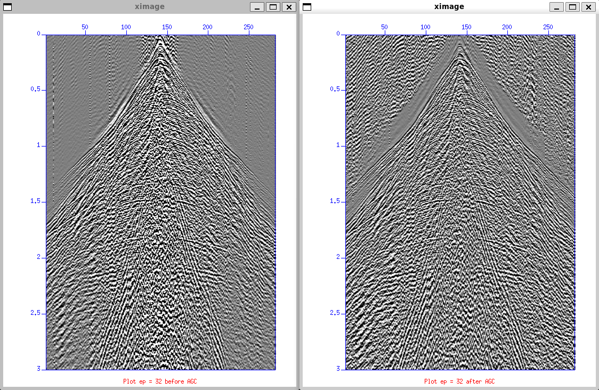
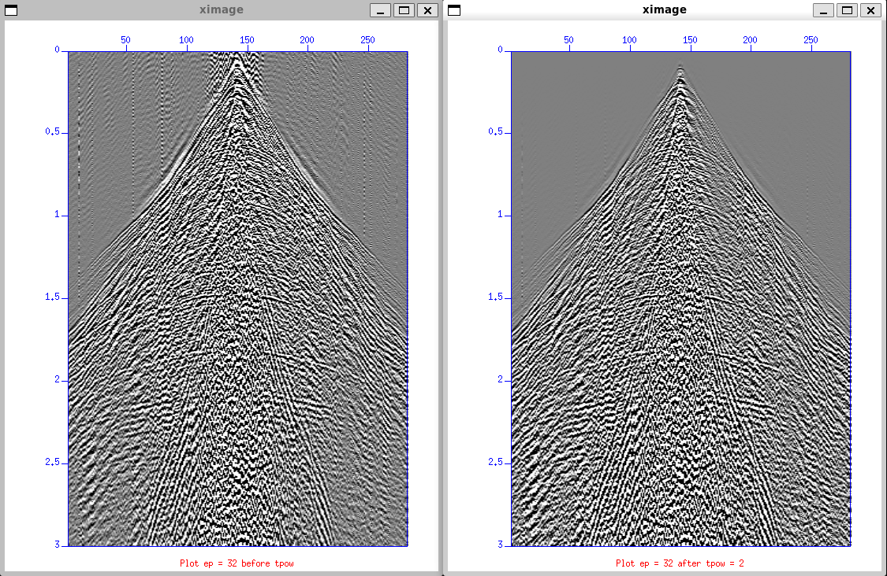

# Gain Testing
There are two type of gain algorithm, data dependent and data independent. `sugain` is a gain function in Seismic Unix. There are a lot of gain function if you check the manual book. 

## Data Dependent Gain
First, we'll try data dependent amplitude correction using Automatic Gain Control (AGC). Before visualizing data, AGC is often applied. It means subdividing each trace into windoes with user-specific length. The RMS amplitude within the window is calculated to the samples within the window. AGC is an axample of amplitude information from the data is used to scale it.

To apply AGC to our dataset, the following command is used:
```bash
#!/bin/sh

# Parameter
indata=Line_001_geom.su
ep=32
perc=80

# Take one shot (ep 32)
suwind < $indata key=ep min=$ep max=$ep > ${indata%.su}_ep${ep}.su

# Plot before AGC
suximage < ${indata%.su}_ep${ep}.su perc=$perc title="Plot ep = $ep before AGC" &

# Do AGC
sugain agc=1 < ${indata%.su}_ep${ep}.su > ${indata%.su}_ep${ep}_agc.su

# Plot after AGC
suximage < ${indata%.su}_ep${ep}_agc.su perc=$perc title="Plot ep = $ep after AGC" &

# Apply AGC to dataset
sugain agc=1 < $indata > ${indata%.su}_agc.su
```
The output will loke like this:

The left image is seismic before AGC and the right image is after AGC is applied.

What about the size of the sub-dividing windows? Isn't the user supposed to supply this piece of information? The reason is in the `sugain` command will use default values if we don't supply any. To see default values, type `sugain` in terminal to see all options:

```bash
 SUGAIN - apply various types of gain

 sugain <stdin >stdout [optional parameters]

 Required parameters:
        none (no-op)

 Optional parameters:
        panel=0         =1  gain whole data set (vs. trace by trace)
        tpow=0.0        multiply data by t^tpow
        epow=0.0        multiply data by exp(epow*t)
        etpow=1.0       multiply data by exp(epow*t^etpow)
        gpow=1.0        take signed gpowth power of scaled data
        agc=0           flag; 1 = do automatic gain control
        gagc=0          flag; 1 = ... with gaussian taper
        wagc=0.5        agc window in seconds (use if agc=1 or gagc=1)
        trap=none       zero any value whose magnitude exceeds trapval
        clip=none       clip any value whose magnitude exceeds clipval
        pclip=none      clip any value greater than clipval
        nclip=none      clip any value less than  clipval
        qclip=1.0       clip by quantile on absolute values on trace
        qbal=0          flag; 1 = balance traces by qclip and scale
        pbal=0          flag; 1 = bal traces by dividing by rms value
        mbal=0          flag; 1 = bal traces by subtracting the mean
        maxbal=0        flag; 1 = balance traces by subtracting the max
        scale=1.0       multiply data by overall scale factor
        norm=0.0        divide data by overall scale factor
        bias=0.0        bias data by adding an overall bias value
        jon=0           flag; 1 means tpow=2, gpow=.5, qclip=.95
        verbose=0       verbose = 1 echoes info
        mark=0          apply gain only to traces with tr.mark=0
                        =1 apply gain only to traces with tr.mark!=0
        vred=0          reducing velocity of data to use with tpow
```

Possible parameters to the `sugain`command are listed, and default values are given. In our case, we have `wagc=1`, which means that the window is 1 seconds long. Try experimenting the window length with other:
```bash
sugain agc=1 wagc=1 < ${indata%.su}_ep${ep}.su | suximage perc=80 &
```

## Data Independent Gain
These operations don't permanently after the data, like dependent operations did. If the inverse function is applied to the original data can, in principle, be restored. Using `sugain` command both multiplication by power of time and exponential gain can be achieved. These two parameters must be given to the `sugain` command:

`tpow` -> Multiply data by $t^{pow}$

`epow` -> Multiply data by $e^{pow}$

So giving this command will apply a gain function with a power of two ($t^2$) to the data:

```bash
#!/bin/sh

# Parameter
indata=Line_001_geom.su
ep=32
perc=80
tpow=2

# Take one shot (ep 32)
suwind < $indata key=ep min=$ep max=$ep > ${indata%.su}_ep${ep}.su

# Plot before tpow
suximage < ${indata%.su}_ep${ep}.su perc=$perc title="Plot ep = $ep before tpow = $tpow" &

# Do tpow
sugain tpow=$tpow < ${indata%.su}_ep${ep}.su > ${indata%.su}_ep${ep}_tpow.su

# Plot after tpow
suximage < ${indata%.su}_ep${ep}_tpow.su perc=$perc title="Plot ep = $ep after tpow = $tpow" &

# Apply tpow to dataset
sugain tpow=$tpow < $indata > ${indata%.su}_tpow.su
```

The output from `tpow = 2` will look like this:


## Output Summary

| Step | Description                                  | Output File                  |
| ---- | -------------------------------------------- | ---------------------------- |
| 1    | Extracted single shot (ep = 32)              | `Line_001_geom_ep32.su`      |
| 2    | Single shot after AGC applied                | `Line_001_geom_ep32_agc.su`  |
| 3    | Full dataset after AGC applied               | `Line_001_geom_agc.su`       |
| 4    | Single shot after time-power gain (tpow = 2) | `Line_001_geom_ep32_tpow.su` |
| 5    | Full dataset after time-power gain applied   | `Line_001_geom_tpow.su`      |

## Parameter Summary
> `sugain` using `agc`
> `sugain` using `tpow=2`