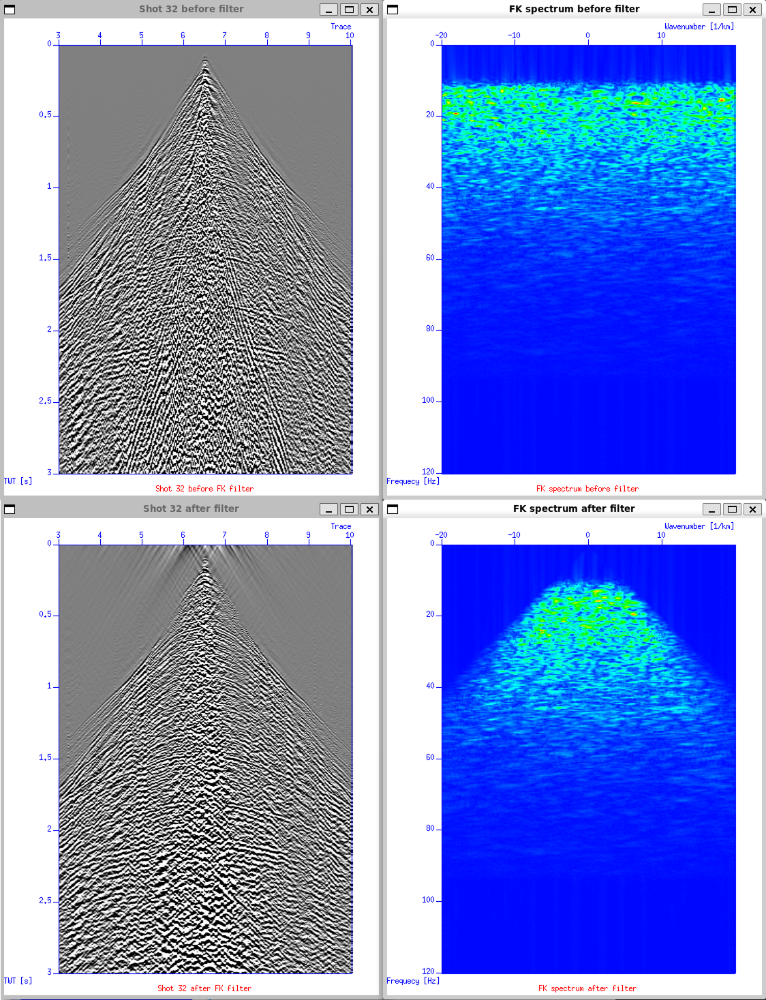
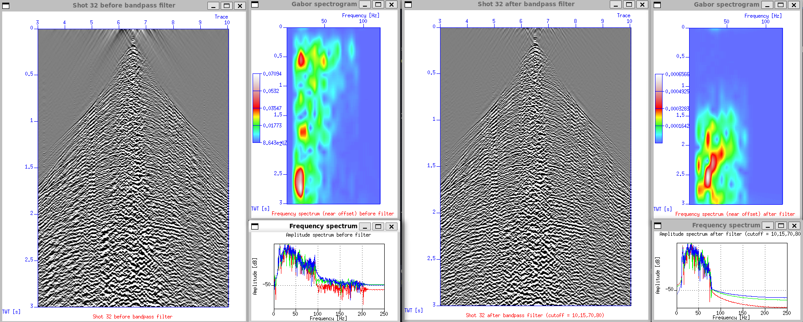

# Noise Attenuation
Seismic data is packed with all kinds of noise. To clean things up, we use signal enhancement tools both before stacking (prestack) and after stacking (post-stack) the Common Midpoint (CMP) gathers. 

Table below gives example of common observed types of noise that can contribute to the seismic data.
|Coherent Noise|Ambient Noise|
|--------------|-------------|
| Ground roll | Recording equipment |
| Direct wave | Bad geophone coupling |
| Reverberation | Spikes |
| Ship noise | Weather/wind |
| Rig noise | Swell noise |
| Rig diffraction | Vehicles |
| Power lines | Animals |

In these notes, we'll break down how to reduce noise from sesimic data using band-pass filtering, f-k filtering, and deconvolution.

## F-K Filter
Filtering in the frequency–wavenumber (f-k) domain, also known as dip or velocity filtering, is used to separate seismic energy based on its apparent velocity. All seismic events that originate from the same source and travel at the same propagation velocity appear as one dipping event in the time domain. In the f-k domain, this dipping event is represented as a straight line through the origin, assuming it contains the full frequency spectrum. By applying filters in the f-k domain, we can selectively remove or preserve certain dips, which correspond to different velocities.

A 2D Fourier transform is required to move data into the f-k domain. The first transform converts the time axis into the frequency axis, while the second converts the spatial (x) axis into wavenumbers. The wavelength $\lambda$ of the spatial wave defines the wavenumber $k$ through $k=1/\lambda$. Just as frequency (cycles per second) is the inverse of period, wavenumber (cycles per meter) is the inverse of wavelength.

In simple terms, steep events in the time domain correspond to low wavenumbers in the f-k domain, while flatter events correspond to higher wavenumbers. The direction of the dip is indicated by the sign of the wavenumber. This approach helps distinguish and filter events based on their apparent velocities, making it a key step in seismic preprocessing.

The `fk` script is shown below.

```bash
#!/bin/sh

killall ximage
killall xgraph
# FK filter

# Parameter
indata=Line_001_geom_agc_wagc0.5.su
outdata=Line_001_geom_agc_wagc0.5_d2_fk.su
dt=0.002
dx=0.025
ep=32
perc=80

slopes=-0.5,-0.3,0.3,0.5
amps=0,1,1,0
bias=0

#-------------------------------------------
#---------- Apply spatial sampling ---------
#-------------------------------------------
sushw < $indata key=d2 a=0.025 > ${indata%.su}_d2.su

#-------------------------------------------
#--------------- Before filter -------------
#-------------------------------------------
# Take one shot (i.e. use ep)
suwind < $indata key=ep min=$ep max=$ep > tmp1

# Plot before FK
suximage < tmp1 perc=$perc title="Shot $ep before FK filter" label1="TWT [s]" label2="Trace" windowtitle="Shot $ep before filter" &

# Plot FK spectrum before filter
suspecfk < tmp1 dt=$dt dx=$dx | suximage perc=97 cmap=hsv2 x1end=120 legend=1 title="FK spectrum before filter" label1="Frequecy [Hz]" label2="Wavenumber [1/km]" windowtitle="FK spectrum before filter" &

#-------------------------------------------
#-------------- After filter ---------------
#-------------------------------------------
# FK filter in single shot
sudipfilt < tmp1 dt=$dt dx=$dx slopes=$slopes amps=$amps bias=$bias > tmp2

# Plot after FK
suximage < tmp2 perc=$perc title="Shot $ep after FK filter" label1="TWT [s]" label2="Trace" windowtitle="Shot $ep after filter" &

# Plot FK spectrum after filter
suspecfk < tmp2 dt=$dt dx=$dx | suximage perc=97 cmap=hsv2 x1end=120 legend=1 title="FK spectrum after filter" label1="Frequecy [Hz]" label2="Wavenumber [1/km]" windowtitle="FK spectrum after filter" &

#-------------------------------------------
# Apply FK
#-------------------------------------------
sudipfilt < ${indata%.su}_d2.su dt=$dt dx=$dx slopes=$slopes amps=$amps bias=$bias > $outdata

rm -f tmp*
```

The filter test presented below, the filter slopes were chosen as -0.5,-0.3,0.3,0.5. The ground roll can be efectively removed by using fk filter. The filtered data and fk spectrum shows that flat slopes at low frequency were filtered out.


## Band-pass Filter
A band-pass filter is a frequency-domain filter that works by multiplying the amplitude spectrum of an input trace with a filter operator. In Seismic Unix, the `sufilter` command is used for this process. It performs zero-phase frequency filtering, meaning the signal’s phase is preserved while its unwanted frequencies are removed. The zero-phase, band-limited wavelet used in the band-pass filter acts as the *filter operator*, shaping the signal to highlight the desired frequency range. In a simple term, band-pass filter is like a vibe check for your seismic data. It only keeps the frequencies that “fit the vibe” and removes the rest. 

The practical aspects is explained in Yilmaz, O. (2001). The goal is to pass a certain bandwidth with little or no modification, and to largely suppress the remaining part of the spectrum as much as practical. At first, it appears that this goal can be met by defining the desired amplitude spectrum for the filter operator as follows:

$$
A(f) = 
\begin{cases}
1, & f_1 < f < f_2; \\
0, & \text{otherwise,}
\end{cases}
$$

Now, let’s get into how this is actually done using the `sufilter` command in Seismic Unix. The `bpf` script is shown below.

```bash
#!/bin/sh

killall ximage
killall xgraph

# Bandpass filter

# Parameter
indata=Line_001_geom_agc_wagc0.5_d2_fk.su
f=10,15,55,60
amps=0,1,1,0
perc=80
ep=32
trace_min=3
trace_max=5

#-------------------------------------------
#--------------- Before filter -------------
#-------------------------------------------
# Take one shot
suwind < $indata key=ep min=$ep max=$ep > tmp1

# Plot before filter
suximage < tmp1 perc=$perc title="Shot $ep before bandpass filter" label1="TWT [s]" label2="Trace" windowtitle="Shot $ep before bandpass filter" &
#-------------------------------------------
# Plot Gabor spectrogram (instantanous frequency)
#-------------------------------------------
# Take a few trace
suwind < tmp1 key=offset min=-50 max=50 | sustack key=dt | sugabor fmax=125 band=6 | suximage xbox=990 ybox=5 wbox=330 hbox=470 cmap=hsv6 x2end=150 legend=1 label1="TWT [s]" label2="Frequency [Hz]" title="Frequency spectrum (near offset) before filter" windowtitle="Gabor spectrogram" &
#-------------------------------------------
# Plot frequency spectrum
#-------------------------------------------
suwind < tmp1 key=tracf min=$trace_min max=$trace_max | sufft | suamp mode=amp | suop op=db | suxgraph style=normal -geometry 330x200+665+510 x1end=250 grid1=dot grid2=dot title="Amplitude spectrum before filter" label1="Frequency [Hz]" label2="Amplitude [dB]" windowtitle="Frequency spectrum" &

#-------------------------------------------
#-------------- After filter ---------------
#-------------------------------------------
# Bandpass filter in single shot
sufilter < tmp1 f=$f amps=$amps > tmp2

# Plot after filter
suximage < tmp2 perc=$perc title="Shot $ep after bandpass filter (cutoff = $f)" label1="TWT [s]" label2="Trace" windowtitle="Shot $ep after bandpass filter" &
#-------------------------------------------
# Plot Gabor spectrogram (instantanous frequency)
#-------------------------------------------
# Take a few trace
suwind < tmp2 kkey=offset min=-50 max=50 | sustack key=dt | sugabor fmax=125 band=6 | suximage xbox=990 ybox=5 wbox=330 hbox=470 cmap=hsv6 x2end=150 legend=1 label1="TWT [s]" label2="Frequency [Hz]" title="Frequency spectrum (near offset) after filter" windowtitle="Gabor spectrogram" &
#-------------------------------------------
# Plot frequency spectrum
#-------------------------------------------
suwind < tmp2 key=tracf min=$trace_min max=$trace_max | sufft | suamp mode=amp | suop op=db | suxgraph style=normal -geometry 330x200+665+510 x1end=250 grid1=dot grid2=dot title="Amplitude spectrum after filter (cutoff = $f)" label1="Frequency [Hz]" label2="Amplitude [dB]" windowtitle="Frequency spectrum" &

#-------------------------------------------
# Apply BPF
#-------------------------------------------
sufilter < $indata f=$f amps=$amps > ${indata%.su}_bpf${f}.su

rm -f tmp*
```

The image below shows the result of the band-pass filter with cut-off frequencies of 10, 15, 70, and 80 Hz. Most of the ground-roll energy is removed after applying the filter. Increasing the low-cut frequency can further reduce noise, but it should be done carefully since it may also remove parts of the useful signal that share similar frequencies.
 

## Deconvolution
Deconvolution compresses the basic wavelet in the recorded seismogram, attenuates reverberations and short-period multiples, and improves temporal resolution, giving a clearer representation of subsurface reflectivity. Beyond simple wavelet compression, deconvolution also helps suppress multiple energy in the seismic section. This process is commonly implemented using an inverse filter as the deconvolution operator, which ideally recovers the earth's impulse response when applied to a seismogram. The inverse filter is typically estimated using the least-squares method.

Mathematically, this can be expressed as:

$$
x(t) = w(t) * r(t) + n(t)
$$

where $r(t)$ is the recorded trace, $w(t)$ is the source wavelet, $r(t)$ is the reflectivity, and $n(t)$ is noise. Deconvolution aims to recover $r(t)$ by minimizing the wavelet effect through inverse filtering.

In practice, deconvolution in Seismic Unix can be performed using the `supef` command, which applies predictive deconvolution to enhance resolution and reduce short-period multiples. The `decon` script is shown below.

```bash
#!/bin/sh

killall ximage
killall xwigb
killall xgraph

# Deconvolution

# Parameter
indata=Line_001_geom_agc_wagc0.5_d2_fk_bpf10,15,55,60.su
ep=150
perc=95
minlag=0.02
maxlag=0.1
pnoise=0.001
ntout=120
tnmo=0.1,1,2
vnmo=1700,2750,3000

#-------------------------------------------
#----------- Before deconvolution ----------
#-------------------------------------------
# Take one shot
suwind < $indata key=ep min=$ep max=$ep | sunmo tnmo=$tnmo vnmo=$vnmo > tmp1
#suwind < $indata key=ep min=$ep max=$ep > tmp1
#-------------------------------------------
# Plot before deconvolution
#-------------------------------------------
suximage < tmp1 perc=$perc title="Shot $ep before deconvolution" label1="TWT [s]" label2="Trace" windowtitle="Shot $ep before deconvolution" &
#-------------------------------------------
# Autocorrelation before deconvolution
#-------------------------------------------
suacor < tmp1 suacor ntout=$ntout | suximage perc=80 title="Autocorrelation before deconvolution" label1="TWT [s]" label2="Offset [m]" windowtitle="Autocorrelation" &

#-------------------------------------------
#----------- After deconvolution ----------
#-------------------------------------------
# Deconvolution
supef < tmp1 minlag=$minlag maxlag=$maxlag pnoise=$pnoise > tmp2 
#-------------------------------------------
# Plot after deconvolution
#-------------------------------------------
suximage < tmp2 perc=$perc title="Shot $ep after deconvolution" label1="TWT [s]" label2="Trace" windowtitle="Shot $ep after deconvolution" &
#-------------------------------------------
# Autocorrelation after deconvolution
#-------------------------------------------
suacor < tmp2 suacor ntout=$ntout | suximage perc=80 title="Autocorrelation after deconvolution" label1="TWT [s]" label2="Offset [m]" windowtitle="Autocorrelation" &

#-------------------------------------------
# Apply deconvolution
#-------------------------------------------
supef < $indata minlag=$minlag maxlag=$maxlag pnoise=$pnoise > ${indata%.su}_decon.su 

rm -f tmp*
```

After some filtering process, we can QC the stack
```bash
#!/bin/sh

killall ximage
killall xgraph

# Brute stack
data1=Line_001_geom_agc_wagc0.5_d2_fk_bpf10,15,55,60.su
data2=Line_001_geom_agc_wagc0.5_d2_fk_bpf10,15,55,60_decon.su
vnmo=1700,2750,3000
tnmo=0.1,1,2

# Sort to CDP
susort cdp offset < $data1 > tmp1
susort cdp offset < $data2 > tmp2

# Before Decon
sunmo < tmp1 vnmo=$vnmo tnmo=$tnmo | sustack > filter_stack.su
suximage < filter_stack.su perc=90 cmap=hsv5 title="Brute stack V0 after FK filter and BPF" label1="Time [s]" label2="CDP" windowtitle="Brute stack" &

# After Decon
sunmo < tmp2 vnmo=$vnmo tnmo=$tnmo | sustack > decon_stack.su
suximage < decon_stack.su perc=90 cmap=hsv5 title="Brute stack V0 after decon" label1="Time [s]" label2="CDP" windowtitle="Brute stack" &

rm -f tmp*
```

### Brute Stack Comparison Before and After Deconvolution


Notice that the reflector is enhanced and multiples are attenuated between 1.2–1.4 s.

## Output Summary

## Parameter Summary
*This section will be updated with a summary of the output results.*