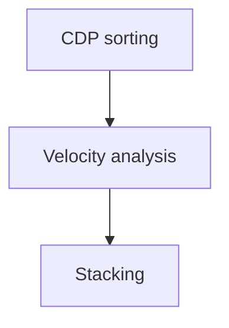

# Velocity Analysis and Stacking
We already performing preprocessing until filtering our dataset. The next step is we need to reveal the first approximation of the subsurface image by performing velocity analysis and stacking. There is script from John W. Stockwell; `iva.sh` a Copyright (c) Colorado School of Mines for doing velocity analysis. This script provide an interactive velocity picking session. It will first ask the user to input number of picks. You are then asked to state the CMP number for the first pick, then it will diplay three plots:
- Semblance plot of the selected CMP number
- Plot of the selected CMP gather
- Constant Velocity Stack of the selected CMP number

From `iva.sh`, we need to define input and output data. The input data is dataset in CDP domain after sorting and the output data is the velocity picks after we run velocity analysis. 

```bash
#!/bin/bash

#set -x

#++++++++++++++++++++++++++++++++++++++++++++++++++++++++++++++++++++++++++++++++++++
#+++++++++++         W A R N I N G    --    W A R N I N G                   +++++++++
#+++++++++++                                                                +++++++++
#+++++++++++    Script will crash  - see comments in line 142               +++++++++
#++++++++++++++++++++++++++++++++++++++++++++++++++++++++++++++++++++++++++++++++++++

indata= [-------- YOUR CDP DATA --------]
outdata=vpick.data   <-- OUTPUT PICK DATA

if [ ! -f $indata ]
then    echo "Sort to CMP first!"
        pause EXIT
        exit 
fi

echo "Velocity Analysis"

rm -f panel.* picks.* par.* tmp*

#------------------------------------------------
# Defining Variables etc...
#------------------------------------------------

nt=1501			# Number of samples
dt=0.002		# Sample time interval

nv=50   		# Number of Velocities
dv=40    		# Interval
fv=1200  		# First Velocity

>$outdata   		# Write an empty file
>par.cmp    		# Write an empty file

...
```



## CDP Sorting