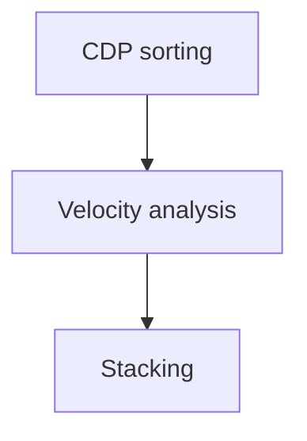
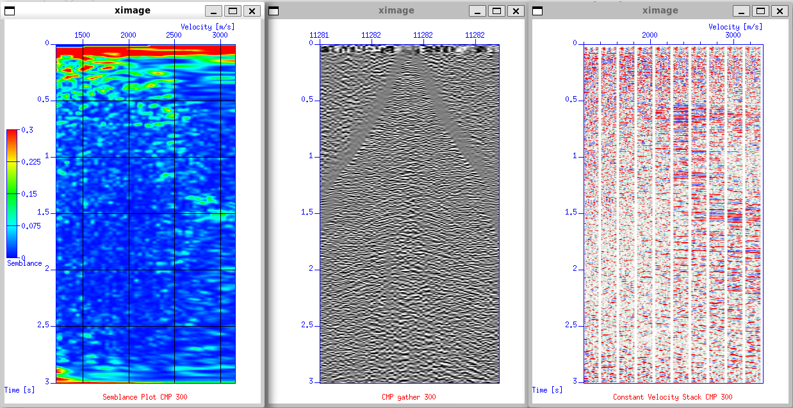
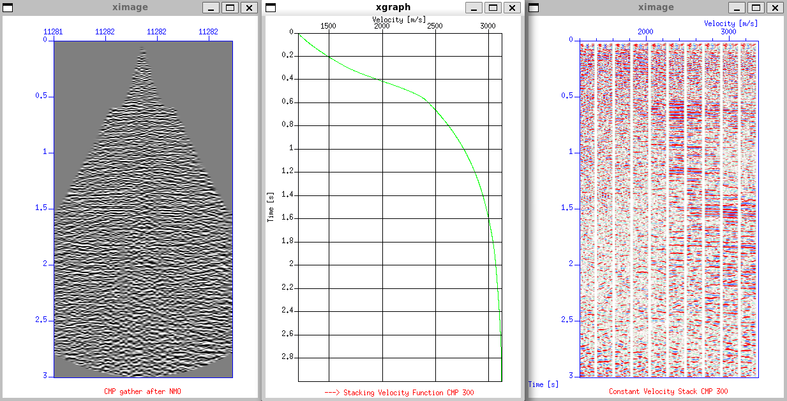

# Velocity Analysis and Stacking
We already performing preprocessing until filtering our dataset. The next step is we need to reveal the first approximation of the subsurface image by performing velocity analysis and stacking. There is script from John W. Stockwell; `iva.sh` a Copyright (c) Colorado School of Mines for doing velocity analysis. This script provide an interactive velocity picking session. It will first ask the user to input number of picks. You are then asked to state the CMP number for the first pick, then it will diplay three plots:
- Semblance plot of the selected CMP number
- Plot of the selected CMP gather
- Constant Velocity Stack of the selected CMP number

From `iva.sh`, we need to define input and output data. The input data is dataset in CDP domain after sorting and the output data is the velocity picks after we run velocity analysis. 

```bash
#!/bin/bash

#set -x

#++++++++++++++++++++++++++++++++++++++++++++++++++++++++++++++++++++++++++++++++++++
#+++++++++++         W A R N I N G    --    W A R N I N G                   +++++++++
#+++++++++++                                                                +++++++++
#+++++++++++    Script will crash  - see comments in line 142               +++++++++
#++++++++++++++++++++++++++++++++++++++++++++++++++++++++++++++++++++++++++++++++++++

indata= [-------- YOUR CDP DATA --------]
outdata=vpick.data   <-- OUTPUT PICK DATA

if [ ! -f $indata ]
then    echo "Sort to CMP first!"
        pause EXIT
        exit 
fi

echo "Velocity Analysis"

rm -f panel.* picks.* par.* tmp*

#------------------------------------------------
# Defining Variables etc...
#------------------------------------------------

nt=1501			# Number of samples
dt=0.002		# Sample time interval

nv=50   		# Number of Velocities
dv=40    		# Interval
fv=1200  		# First Velocity

>$outdata   		# Write an empty file
>par.cmp    		# Write an empty file

...
```



## CDP Sorting
Before performing velocity analysis, the data must first be sorted into CDP gathers. This can be done using the `susort` command with the `cdp offset` keys to reorganize the traces accordingly. Sorting the dataset into CDP order is essential because velocity analysis relies on evaluating moveout within each gather, which is only meaningful when traces belonging to the same subsurface location are grouped together.

```bash
susort cdp offset < Line_001_geom_agc_wagc0.5_d2_fk_bpf15,20,70,80_decon.su > Line_001_geom_agc_wagc0.5_d2_fk_bpf15,20,70,80_decon_cdp.su
```

## Velocity Analysis

Velocity analysis is a fundamental step in seismic processing because accurate stacking velocities are required to properly align reflection events and obtain a coherent stacked section. Several velocity types exist in seismic reflection, including interval, RMS, NMO, and stacking velocity. Among these, stacking velocity is the most relevant for imaging and NMO correction.

### Semblance Plot

Semblance measures multichannel coherence. High semblance values indicate that reflection events are well aligned for a given trial velocity; therefore, peaks in semblance are used as velocity picks. A semblance plot displays coherence as a function of time and velocity.

### Constant Velocity Stack

A constant velocity stack presents panels generated by applying NMO correction with a single constant velocity across all times. Comparing these panels helps assess reflector continuity and guides velocity selection.

To run the `iva.sh` script, execute `./iva.sh` after setting the required parameters. The input should be the deconvolved (in this processing sequence), CDP-sorted dataset, and you must define a filename for the velocity picks. The script will prompt for the number of picks and their CMP locations. The generated outputs include the semblance plot, the corresponding CMP gather, and the constant-velocity stack. Velocity picking is done by placing the cursor on the semblance plot and typing s; when all picks are completed, type q.

In practice, initial velocity analysis is usually performed with a relatively coarse CMP interval, for example every 50 to 100 CMPs, to obtain a preliminary velocity trend. After this first pass, the analysis is repeated with a shorter interval (e.g., every 20 to 25 CMPs) in zones of structural complexity or where velocity variations are expected. This iterative refinement helps produce a smooth and geologically consistent stacking-velocity field.



After picking, the script outputs the NMO-corrected CMP gather and the derived stacking-velocity function. The velocity picks are saved in a file, typically named vpick.data. This file will later be used as input for the NMO correction step using sunmo, where the selected stacking velocities are applied to flatten reflection events prior to stacking.



## Normal Moveout Correction

Normal moveout (NMO) correction adjusts each trace in a CMP gather to compensate for the travel-time increase with offset. This step requires a velocity function, which in this workflow is the stacking velocity picked using the `iva.sh` script and stored in `vpick.data`. Applying NMO using these velocities flattens the reflection events across offsets, enabling coherent stacking.

The NMO correction is applied using the sunmo command:
```bash
sunmo par=vpick.data < Line_001_geom_agc_wagc0.5_d2_fk_bpf15,20,70,80_decon_cdp.su > Line_001_v1_cdp.su
```

## Stacking
After NMO correction, the gathers are stacked to produce a preliminary stacked section, which serves as a quality check on the initial velocity analysis. Stacking is performed using `sustack`:

```bash
sustack < Line_001_v1_cdp.su | suximage perc=90 cmap=hsv4 title="Brute stack V1 after velan" label1="Time [s]" label2="CDP" windowtitle="Brute stack" &
```


This stack provides an early view of reflector continuity before applying statics correction and further velocity refinement.

## Output Summary
| Step | Description                                  | Output File                  |
| ---- | -------------------------------------------- | ---------------------------- |
| 1    | Dataset after CDP sorted              | `Line_001_geom_agc_wagc0.5_d2_fk_bpf15,20,70,80_decon_cdp.su`      |
| 2    | Velocity picking data                | `vpick.data`  |
| 3    | Dataset after NMO correction               | `Line_001_v1_cdp.su`       |

## Script Used
`iva.sh`