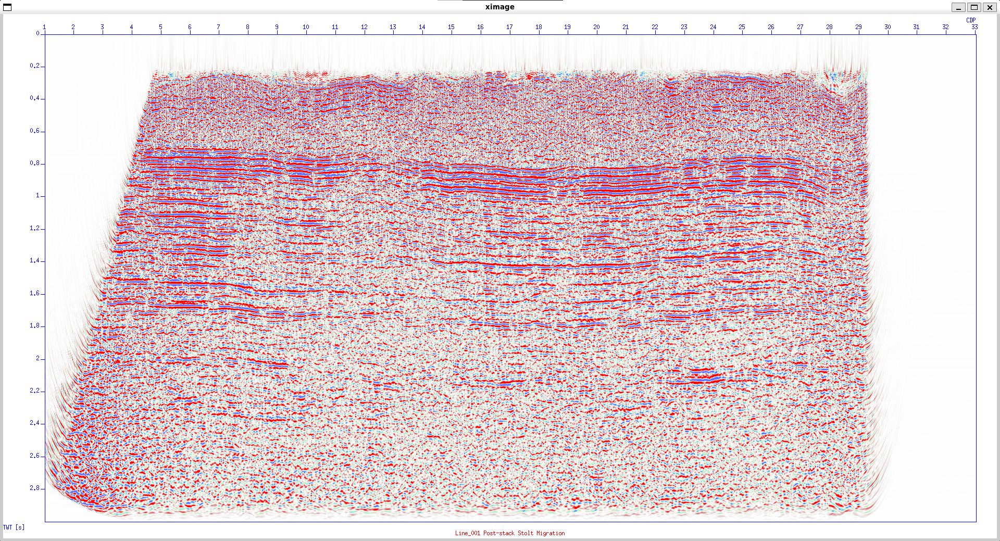

# Migration
In this stage, I demonstrate how to perform Post-Stack Time Migration (PoSTM) using Seismic Unix. SU provides several migration algorithms, including Stolt Migration, Gazdag or Phase-Shift Migration, Claerbout’s Migration, and others. Each method has its own strengths and limitations, but for this workflow I use the Stolt method because it is fast, stable, and well suited for post-stack data.

PoSTM is applied to the stacked section that has already undergone velocity analysis and static corrections. Before migration, I apply mute and tapering to smooth the edges of the section. This step is important because sharp amplitude contrasts at the borders can introduce migration artifacts. Although `sustolt` includes internal tapering, applying an additional mute and taper beforehand helps stabilize the result.

The migration is then performed using the RMS velocity field obtained from the earlier velocity analysis (here I use the RMS velocity from CMP 1000). Below is the `stoltmig` script used to apply muting, display the pre-migration stack, run Stolt Migration, and display the migrated section:
```bash
#!/bin/sh

sumute < Line_001_stack_v2_resstat.su key=tracl xmute=1,150,1132,1132 tmute=3.0,0.2,0.2,3.0 ntaper=50 > Line_001_stack_v2_resstat_mute.su

suximage < Line_001_stack_v2_resstat_mute.su key=cdp perc=90 title='Before Stolt Migration' &

time=0.0187891,0.494781,0.914405,1.37787,1.94781,2.90605
vels=1992.35,2211.92,2488.77,2765.61,2975.64,3319.31

sustolt < Line001_stack_vel2_elev_rstat_mute.su > Line_001_PoSTM.su cdpmin=1 cdpmax=1282 dxcdp=50 tmig=$time vmig=$vels smig=0.6 vscale=1 lstaper=50 lbtaper=50 

suximage < Line_001_PoSTM.su title="Line_001 Post-stack Stolt Migration" label1="TWT [s]" label2="CDP" key=cdp min=100 max=1100 perc=90 verbose=0 &
```

Run the script by `./stoltmig.sh`

The first display shows the stacked section before migration. After running the script, the second display shows the section after Stolt Migration.

The migration is shown below

