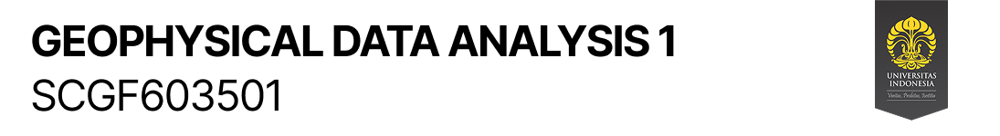
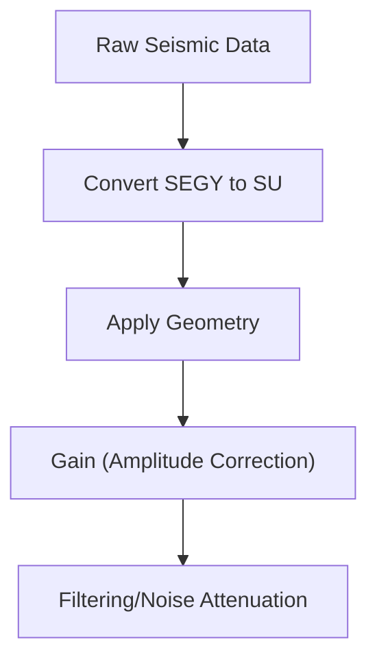

# Geophysical Data Analysis 1
Course notes for the Geophysical Data Analysis 1 course (2025/2026 - 1) taught by Ayunda Aulia Valencia, S.T., M.T. and Agus Riyanto, M.Si. at the Department of Geoscience for [BSc. in Geophysics](https://geosciences.ui.ac.id/program-studi-s1-geofisika/). This course is divided into two classes, each taught by a different lecturer. While the overall learning objectives are aligned, there may be slight differences in the syllabus and course materials between the two.



## Prerequisites & Dependencies

- **Seismic Un*x:** Required for running the Seismic Un*x-related scripts and exercises.  Installation instructions can be found at the [Seismic Un*x website](https://www.cwp.mines.edu/cwpcodes/).
- **Python 3.x:** Necessary for running the Python scripts.
    - Libraries:  Ensure you have the following libraries installed (using pip):
        - `numpy`
        - `matplotlib`
- **MATLAB/Octave:**  For running the MATLAB/Octave scripts. Octave is recommended as a free alternative.
- **A Linux/Unix-like environment:** While some tools might work on Windows, the scripts are designed for a Unix-like environment (e.g., Linux, macOS, or WSL on Windows).

## Installation & Setup Instructions

1.  **Clone the repository:**

    ```bash
    git clone https://github.com/vandanue/ADG-1.git
    cd ADG-1
    ```

2.  **Seismic Un*x:**

    -  Make sure Seismic Un*x is installed and properly configured in your environment.
    -  Verify that the `$CWPROOT` environment variable is set correctly.

3.  **Python Environment (Optional):**

    -  Create a virtual environment (recommended):

        ```bash
        python3 -m venv venv
        source venv/bin/activate  # On Linux/macOS
        # venv\Scripts\activate  # On Windows
        ```

    -  Install the required Python packages:

        ```bash
        pip install numpy matplotlib
        ```

4.  **MATLAB/Octave:**

    - Ensure MATLAB or Octave is installed on your system.
    - Octave is free and can be easily installed with your distribution's package manager (e.g., `apt-get install octave`).

## Usage Examples

### Applying Geometry using Octave

1. Navigate to the `Scripts/1_geometry/matlab-octave/` directory.
2.  Open `geom_octave.m` in Octave.
3.  Run the script:

    ```octave
    octave:1> geom_octave
    ```
    This script requires the `extract_geom_ps` and `geom_header_reg_offset.bin` files to be present in the same directory.

### Applying Geometry using Python

1.  Navigate to the `Scripts/1_geometry/python/` directory.
2.  Open `geometry.py`.
3.  Run the script:

    ```bash
    python geometry.py
    ```

### Running Seismic Un*x Commands (Examples are within the note files)

Refer to the specific markdown files in the `Notes/` directory for examples on how to use Seismic Un*x commands within shell scripts for tasks like gain testing and noise attenuation. Example usage is explained in each markdown file.

## Configuration Options

-   Most scripts can be configured by modifying variables directly within the script files (e.g., changing file paths, adjusting gain parameters, etc.).
-   Seismic Un*x configuration is typically done through environment variables and parameters passed to SU commands.  Refer to the SU documentation for more details.

## Contributing Guidelines

1.  Fork the repository.
2.  Create a new branch for your feature or bug fix:

    ```bash
    git checkout -b feature/your-feature-name
    ```

3.  Make your changes and commit them with descriptive messages.
4.  Push your branch to your forked repository.
5.  Create a pull request to the main repository.

## License Information

This project has no license currently specified.  All rights are reserved by the owner.

## Acknowledgments

-   The content of this repository is based on course materials from Geophysical Data Analysis 1 (SCGF603501).
-   Seismic Un*x is a product of the Center for Wave Phenomena (CWP) at the Colorado School of Mines.