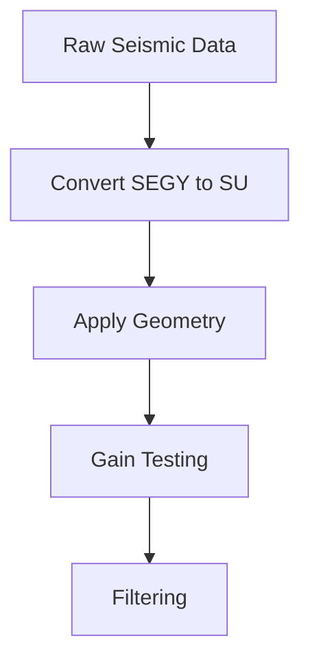

# Geophysical Data Analysis 1
Course notes for the Geophysical Data Analysis 1 course (2025/2026 - 1) taught by Ayunda Aulia Valencia, S.T., M.T. and Agus Riyanto, M.Si. at the Department of Geoscience for [BSc. in Geophysics](https://geosciences.ui.ac.id/program-studi-s1-geofisika/). This course is divided into two classes, each taught by a different lecturer. While the overall learning objectives are aligned, there may be slight differences in the syllabus and course materials between the two.

